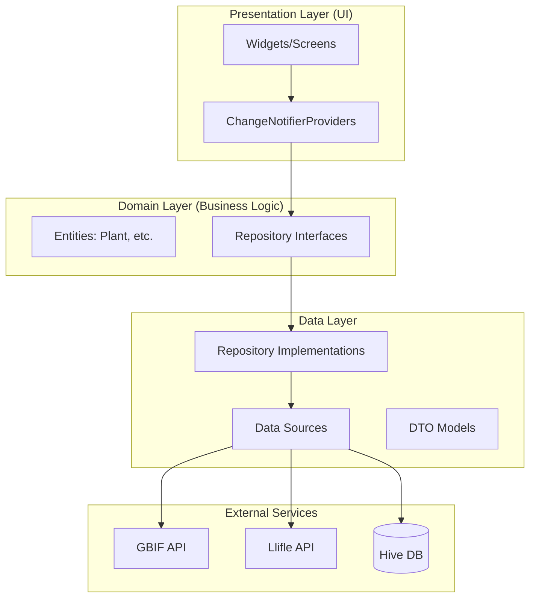
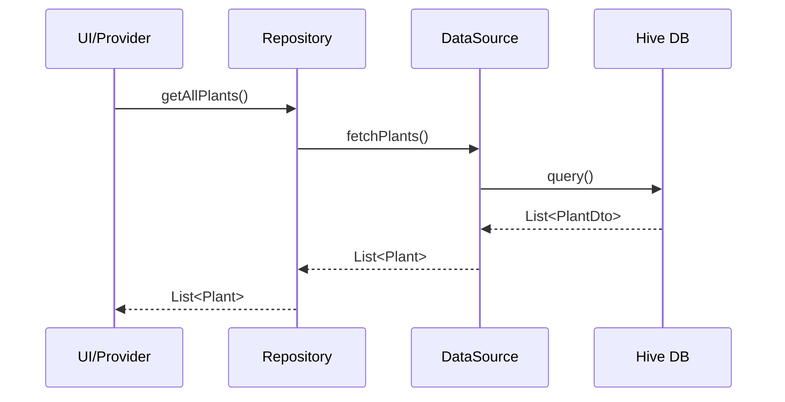
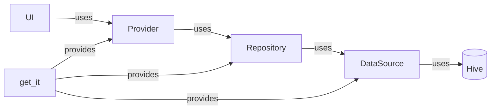

# Архитектура приложения My Cactus

## Общая архитектура (Clean Architecture)

## Слои приложения

### 1. Presentation Layer
- **Screens**: UI экраны (WelcomeScreen, HomeScreen, etc.)
- **Providers**: Управление состоянием (PlantCrudProvider, etc.)
- **Widgets**: Переиспользуемые компоненты

### 2. Domain Layer
- **Entities**: Бизнес-сущности (Plant)
- **Repository Interfaces**: Абстракции для работы с данными

### 3. Data Layer
- **Repository Implementations**: Конкретная реализация репозиториев
- **Data Sources**: Локальные и удалённые источники данных
- **DTO Models**: Модели для сериализации (PlantDto)

## Поток данных

## Ключевые компоненты

| Компонент | Назначение | Файл |
|-----------|-----------|------|
| PlantRepository | CRUD операции с растениями | `domain/repositories/plant_repository.dart` |
| GbifService | Интеграция с GBIF API | `services/api/gbif_service.dart` |
| PlantCrudProvider | Управление состоянием UI | `presentation/providers/plant_crud_provider.dart` |
| HiveDatabase | Локальное хранилище | `data/datasources/local/hive_database.dart` |
| AppLogger | Логирование и Crashlytics | `core/logger/app_logger.dart` |

## Dependency Injection

Используется `get_it` + `injectable` для DI.
