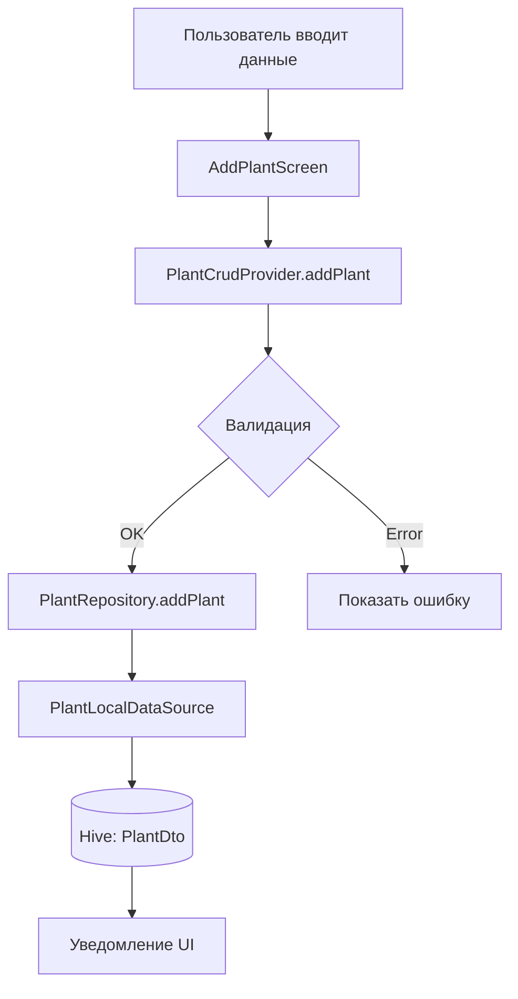
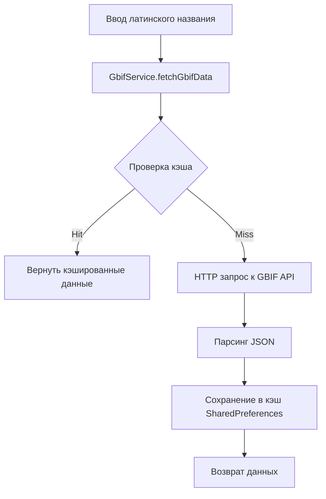
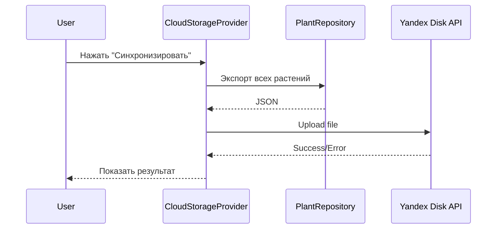
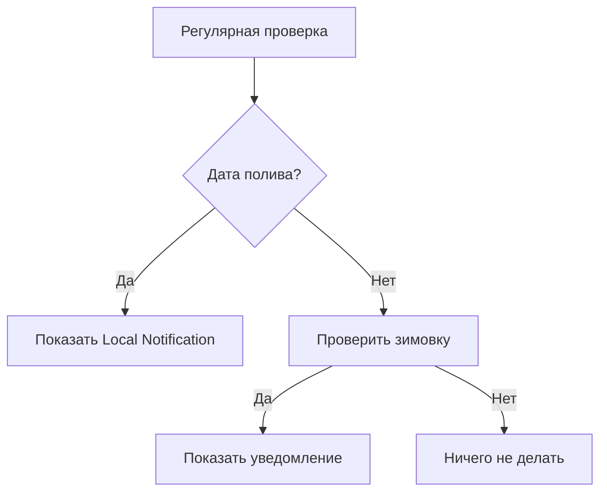

# Потоки данных в приложении

## 1. Добавление нового растения



## 2. Загрузка данных из GBIF



## 3. Синхронизация с облаком (Yandex Disk)



## 4. Полив растения

```mermaid
flowchart LR
    A[Нажатие "Полить"] --> B[WateringProvider.addWateringDate]
    B --> C[Обновление PlantDto]
    C --> D[Сохранение в Hive]
    D --> E[Обновление уведомлений]
    E --> F[UI обновляется]
```

## 5. Уведомления



## Модели данных

### Plant (Entity)
```dart
class Plant {
  final String id;
  final String latinName;
  final String status; // alive, dead, etc.
  final List<String> userPhotos;
  final List<DateTime> wateringDates;
  // ...
}
```

### PlantDto (Data Transfer Object)
```dart
@HiveType(typeId: 0)
class PlantDto extends HiveObject {
  @HiveField(0)
  final String permanentId;
  // ...
}
```

### Преобразование
```
PlantDto (Hive) ↔ Plant (Domain) ↔ JSON (Cloud)
```
