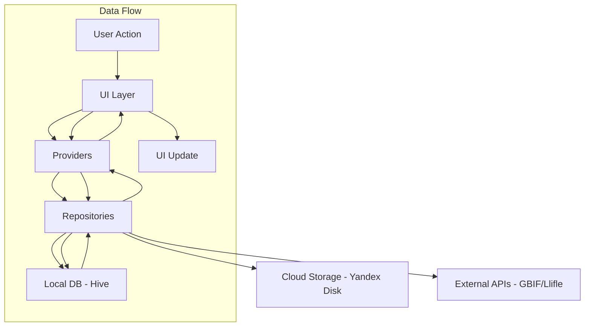

# СОСТОЯНИЕ ПОСЛЕ РЕФАКТОРИНГА - MY CACTUS

**Дата создания:** 2026-05-09
**Статус:** Целевое состояние

---

## Связанные файлы

- [PROMPT.md](PROMPT.md) - инструкции для работы
- [CURRENT_STATUS.md](CURRENT_STATUS.md) - текущий статус
- [03-CURRENT_REFACTORING_STEP.md](03-CURRENT_REFACTORING_STEP.md) - текущий шаг
- [00-BEFORE_REFACTORING.md](00-BEFORE_REFACTORING.md) - состояние до рефакторинга
- [02-REFACTORING_PLAN.md](02-REFACTORING_PLAN.md) - план рефакторинга

---

## Общая информация

### Платформы
- **Android:** G:\cactus-project\Android
- **Windows:** G:\cactus-project\Windows
- **Фреймворк:** Flutter
- **Язык:** Dart

### Архитектура
Clean Architecture с тремя слоями:
- **Presentation Layer** - Screens, Widgets, Providers/BLoCs
- **Domain Layer** - Use Cases, Entities, Repositories
- **Data Layer** - Repositories Impl, Data Sources, DTO

### Принципы SOLID
- **S (Single Responsibility):** Каждый класс отвечает за одну функцию
- **O (Open/Closed):** Открыт для расширения, закрыт для изменений
- **L (Liskov Substitution):** Подклассы заменяемы базовыми классами
- **I (Interface Segregation):** Много специализированных интерфейсов
- **D (Dependency Inversion):** Зависимость от абстракций

---

## Новая структура проекта

```
lib/
├── main.dart                    # Точка входа
├── injection_container.dart     # DI конфигурация (get_it)
├── core/
│   ├── error/
│   │   ├── failures.dart        # Абстрактные классы ошибок
│   │   ├── exceptions.dart      # Исключения
│   │   └── error_handler.dart   # Централизованная обработка
│   ├── logger/
│   │   └── app_logger.dart      # Структурированное логирование
│   ├── utils/
│   │   ├── date_formatter.dart  # Форматирование дат
│   │   ├── validators.dart      # Валидаторы
│   │   └── constants.dart       # Константы
│   ├── config/
│   │   ├── app_constants.dart   # Константы приложения
│   │   ├── api_config.dart      # API конфигурация
│   │   ├── route_config.dart    # Конфигурация маршрутов
│   │   └── theme_config.dart    # Конфигурация темы
│   └── theme/
│       └── cactus_theme.dart    # Тема оформления
├── data/
│   ├── models/
│   │   ├── plant_dto.dart       # DTO для Plant
│   │   └── qr_code_dto.dart     # DTO для QR кода
│   ├── repositories/
│   │   ├── plant_repository_impl.dart
│   │   ├── watering_repository_impl.dart
│   │   ├── photo_repository_impl.dart
│   │   └── sync_repository_impl.dart
│   ├── datasources/
│   │   ├── local/
│   │   │   ├── plant_local_datasource.dart
│   │   │   ├── watering_local_datasource.dart
│   │   │   └── hive_database.dart
│   │   └── remote/
│   │       ├── yandex_cloud_datasource.dart
│   │       ├── gbif_remote_datasource.dart
│   │       └── llifle_remote_datasource.dart
│   └── migrations/
│       └── data_migration_manager.dart
├── domain/
│   ├── entities/
│   │   ├── plant.dart           # Доменная модель Plant
│   │   ├── watering_schedule.dart
│   │   ├── batch.dart
│   │   └── qr_code.dart
│   ├── repositories/
│   │   ├── plant_repository.dart
│   │   ├── watering_repository.dart
│   │   ├── photo_repository.dart
│   │   └── sync_repository.dart
│   └── usecases/
│       ├── get_plants.dart
│       ├── add_plant.dart
│       ├── update_plant.dart
│       ├── delete_plant.dart
│       ├── sync_data.dart
│       └── ...
├── presentation/
│   ├── providers/
│   │   ├── plant_provider.dart          # Только CRUD растений (~300 строк)
│   │   ├── watering_provider.dart       # Поливы (~250 строк)
│   │   ├── wintering_provider.dart      # Зимовка (~200 строк)
│   │   ├── photo_provider.dart          # Фото (~300 строк)
│   │   ├── batch_provider.dart          # Партии (~200 строк)
│   │   ├── sync_provider.dart           # Синхронизация (~250 строк)
│   │   └── cache_manager.dart           # Кэш (~150 строк)
│   ├── screens/
│   │   ├── home/
│   │   │   └── home_screen.dart
│   │   ├── plant_card/
│   │   │   ├── plant_card_screen.dart         # Главный экран (~150 строк)
│   │   │   ├── tabs/
│   │   │   │   ├── overview_tab.dart          # Основная информация (~250 строк)
│   │   │   │   ├── care_tab.dart              # Уход (~300 строк)
│   │   │   │   ├── gallery_tab.dart           # Галерея (~250 строк)
│   │   │   │   ├── notes_tab.dart             # Заметки (~200 строк)
│   │   │   │   ├── map_tab.dart               # Карта (~200 строк)
│   │   │   │   └── seedlings_tab.dart         # Сеянцы (~200 строк)
│   │   │   └── widgets/
│   │   │       ├── plant_header.dart
│   │   │       ├── plant_photos_carousel.dart
│   │   │       ├── watering_history_list.dart
│   │   │       ├── gbif_map_view.dart
│   │   │       └── notes_list.dart
│   │   ├── edit_plant/
│   │   ├── collection_management/
│   │   ├── care_calendar/
│   │   ├── statistics/
│   │   ├── sowing_management/
│   │   ├── wintering/
│   │   ├── qr/
│   │   │   ├── batch_qr_creation_screen.dart
│   │   │   ├── qr_management_screen.dart
│   │   │   └── select_plants_for_print_screen.dart
│   │   └── welcome/
│   ├── widgets/
│   │   ├── common/
│   │   ├── plant/
│   │   └── care/
│   └── routers/
│       └── app_router.dart         # go_router конфигурация
└── services/
    ├── auth/
    │   ├── auth_service.dart
    │   ├── yandex_auth_service.dart
    │   └── token_storage.dart
    ├── cloud/
    │   ├── cloud_storage_service.dart
    │   ├── yandex_disk_service.dart
    │   └── cloud_file.dart
    ├── sync/
    │   ├── sync_manager.dart
    │   ├── conflict_resolver.dart
    │   └── sync_status.dart
    ├── api/
    │   ├── gbif_service.dart
    │   ├── llifle_service.dart
    │   └── weather_service.dart
    ├── image/
    │   ├── image_processor.dart
    │   └── photo_cache_manager.dart
    ├── notifications/
    │   └── notification_service.dart
    └── platform/
        ├── deep_link_handler.dart
        ├── local_server.dart
        └── platform_adapter.dart
```

---

## Ключевые архитектурные изменения

### 1. Разделение PlantProvider (2230 строк → 7 файлов по 150-300 строк)

**Было:**
- Один файл PlantProvider (2230 строк) управляет всем

**Стало:**
```
presentation/providers/
├── plant_provider.dart          # CRUD растений, фильтрация, сортировка (~300 строк)
├── watering_provider.dart       # Даты полива, рекомендации, уведомления (~250 строк)
├── wintering_provider.dart      # Настройки зимовки, журнал записей (~200 строк)
├── photo_provider.dart          # Управление фото, загрузка, кэш (~300 строк)
├── batch_provider.dart          # Система партий сеянцев (~200 строк)
├── sync_provider.dart           # Координация синхронизации (~250 строк)
└── cache_manager.dart           # Централизованное кэширование (~150 строк)
```

### 2. Repository Pattern

**Было:**
```dart
// PlantProvider напрямую работает с SharedPreferences
final prefs = await SharedPreferences.getInstance();
final plantsJson = prefs.getString('plants');
```

**Стало:**
```dart
// domain/repositories/plant_repository.dart
abstract class PlantRepository {
  Future<List<Plant>> getAll();
  Future<Plant?> getById(String id);
  Future<void> insert(Plant plant);
  Future<void> update(Plant plant);
  Future<void> delete(String id);
  Future<void> bulkUpdate(List<Plant> plants);
  Stream<List<Plant>> watchAll();
  Future<int> getCountByStatus(String status);
  Future<List<Plant>> search(String query);
}

// data/repositories/plant_repository_impl.dart
class PlantRepositoryImpl implements PlantRepository {
  final PlantLocalDataSource _localDataSource;
  final PlantRemoteDataSource? _remoteDataSource;
  final NetworkInfo _networkInfo;

  @override
  Future<List<Plant>> getAll() async {
    return await _localDataSource.getAllPlants();
  }
}
```

### 3. Замена SharedPreferences на Hive

**Было:**
- Все данные в одном JSON файле
- Медленная загрузка (2-5 сек для 1000 растений)
- Нет транзакций, индексов

**Стало:**
```yaml
dependencies:
  hive: ^2.2.3
  hive_flutter: ^1.1.0
```

```dart
// data/models/plant_dto.dart
@HiveType(typeId: 0)
class PlantDTO extends HiveObject {
  @HiveField(0)
  String permanentId;

  @HiveField(1)
  String latinName;

  @HiveField(2, index: true)
  String status;

  @HiveField(3, index: true)
  int year;

  @HiveField(4, index: true)
  DateTime lastModified;
}
```

### 4. Dependency Injection (GetIt)

**Было:**
- Зависимости создаются вручную в main.dart и экранах

**Стало:**
```yaml
dependencies:
  get_it: ^7.6.0
  injectable: ^2.3.2

dev_dependencies:
  injectable_generator: ^2.4.1
  build_runner: ^2.4.8
```

```dart
// injection_container.dart
final sl = GetIt.instance;

Future<void> configureDependencies() async {
  // Repositories
  sl.registerLazySingleton<PlantRepository>(
    () => HivePlantRepository(sl()),
  );

  // Services
  sl.registerLazySingleton<WeatherService>(() => WeatherServiceImpl(sl()));
  sl.registerLazySingleton<GbifService>(() => GbifServiceImpl(sl()));
  sl.registerLazySingleton<LlifleService>(() => LlifleServiceImpl(sl()));

  // Providers
  sl.registerFactory(() => PlantProvider(sl(), sl()));
  sl.registerFactory(() => WateringProvider(sl()));
}
```

### 5. Разделение CloudStorageProvider (736 строк → сервисы)

**Было:**
- Один файл смешивает OAuth2, API, синхронизацию, deep links

**Стало:**
```
services/
├── auth/
│   ├── auth_service.dart         # Интерфейс авторизации
│   ├── yandex_auth_service.dart  # OAuth2 для Яндекс
│   └── token_storage.dart        # Хранение токенов
├── cloud/
│   ├── cloud_storage_service.dart # Интерфейс облака
│   ├── yandex_disk_service.dart   # Реализация для Яндекс
│   └── cloud_file.dart            # Модель файла в облаке
├── sync/
│   ├── sync_manager.dart         # Логика синхронизации
│   ├── conflict_resolver.dart    # Разрешение конфликтов
│   └── sync_status.dart          # Статус синхронизации
└── platform/
    ├── deep_link_handler.dart    # Обработка deep links
    ├── local_server.dart         # HTTP сервер для Windows
    └── platform_adapter.dart     # Адаптер платформ
```

### 6. Разбиение PlantCardScreen (104KB → компоненты)

**Было:**
- Один файл 2500+ строк с 6 вкладками

**Стало:**
```
presentation/screens/plant_card/
├── plant_card_screen.dart       # Главный экран (~150 строк)
├── tabs/
│   ├── overview_tab.dart        # Основная информация (~250 строк)
│   ├── care_tab.dart            # Уход и поливы (~300 строк)
│   ├── gallery_tab.dart         # Галерея фото (~250 строк)
│   ├── notes_tab.dart           # Заметки (~200 строк)
│   ├── map_tab.dart             # Карта GBIF (~200 строк)
│   └── seedlings_tab.dart       # Сеянцы (~200 строк)
└── widgets/
    ├── plant_header.dart        # Заголовок с названием (~80 строк)
    ├── plant_photos_carousel.dart # Карусель фото (~120 строк)
    ├── watering_history_list.dart # История поливов (~100 строк)
    ├── gbif_map_view.dart       # Виджет карты (~150 строк)
    ├── notes_list.dart          # Список заметок (~100 строк)
    └── seedling_card.dart       # Карточка сеянца (~90 строк)
```

### 7. Обработка ошибок на уровне архитектуры

**Было:**
- Try-catch разбросаны по коду
- Нет единого стандарта

**Стало:**
```dart
// core/error/failures.dart
abstract class Failure {
  final String message;
  final String? code;
  final Exception? exception;
}

class ServerFailure extends Failure {
  ServerFailure(String message) : super(message, code: 'SERVER_ERROR');
}

class LocalDatabaseFailure extends Failure {
  LocalDatabaseFailure(String message) : super(message, code: 'DB_ERROR');
}

class AuthFailure extends Failure {
  AuthFailure(String message) : super(message, code: 'AUTH_ERROR');
}

// core/error/error_handler.dart
class ErrorHandler {
  Failure handleError(dynamic error, StackTrace stack) {
    if (error is DioException) {
      return _handleDioError(error);
    } else if (error is HiveError) {
      return LocalDatabaseFailure('Ошибка базы данных: ${error.message}');
    }
    return Failure('Произошла непредвиденная ошибка', exception: error);
  }

  String getUserMessage(Failure failure) {
    switch (failure.code) {
      case 'SERVER_ERROR':
        return 'Проблемы с подключением к серверу. Проверьте интернет.';
      case 'DB_ERROR':
        return 'Ошибка при сохранении данных. Попробуйте позже.';
      case 'AUTH_ERROR':
        return 'Требуется повторная авторизация в облаке.';
      default:
        return failure.message;
    }
  }
}
```

### 8. UiState Pattern (loading/error/success)

**Было:**
```dart
try {
  await someAsyncOperation();
} catch (e) {
  print('Error: $e'); // Пользователь ничего не видит
}
```

**Стало:**
```dart
// core/ui/ui_state.dart
sealed class UiState<T> {
  const UiState();
}

class Loading<T> extends UiState<T> {
  final double? progress;
  final String? message;
  const Loading({this.progress, this.message});
}

class Success<T> extends UiState<T> {
  final T data;
  const Success(this.data);
}

class Error<T> extends UiState<T> {
  final String message;
  final Exception exception;
  final VoidCallback? onRetry;
  const Error(this.message, this.exception, {this.onRetry});
}

// Использование в виджетах
Consumer<PlantProvider>(
  builder: (context, provider, _) {
    return provider.plantsState.when(
      loading: (progress) => ProgressIndicator(value: progress),
      success: (plants) => PlantList(plants: plants),
      error: (message, onRetry) => ErrorWidget(
        message: message,
        onRetry: onRetry,
      ),
    );
  },
)
```

### 9. Структурированное логирование

**Было:**
```dart
print('Loading plants...');
print('Error: $e');
print('Sync complete');
```

**Стало:**
```yaml
dependencies:
  logger: ^2.0.0+1
```

```dart
// core/logger/app_logger.dart
class AppLogger {
  static final Logger _logger = Logger(
    printer: PrettyPrinter(
      methodCount: 2,
      errorMethodCount: 8,
      lineLength: 120,
      colors: true,
      printEmojis: true,
      printTime: true,
    ),
    level: Level.debug, // В релизе: Level.warning
  );

  static void d(String message, {String? tag}) => _logger.d(message, tag: tag);
  static void i(String message, {String? tag}) => _logger.i(message, tag: tag);
  static void w(String message, {String? tag}) => _logger.w(message, tag: tag);
  static void e(String message, {Object? error, StackTrace? stackTrace, String? tag})
    => _logger.e(message, error: error, stackTrace: stackTrace, tag: tag);
}

// Категории логов
// SYNC - синхронизация с облаком
// DB - операции с базой данных
// API - запросы к GBIF, Llifle, Weather
// UI - действия пользователя
// PHOTO - операции с фото
// NOTIFICATION - уведомления
```

### 10. go_router навигация

**Было:**
```dart
Navigator.push(
  context,
  MaterialPageRoute(builder: (context) => PlantCardScreen(plant: plant)),
);
```

**Стало:**
```yaml
dependencies:
  go_router: ^14.2.0
```

```dart
// presentation/routers/app_router.dart
final GoRouter appRouter = GoRouter(
  initialLocation: '/',
  routes: [
    GoRoute(
      path: '/',
      name: 'home',
      builder: (context, state) => HomeScreen(),
    ),
    GoRoute(
      path: '/plant/:id',
      name: 'plant-card',
      builder: (context, state) {
        final plantId = state.pathParameters['id']!;
        return PlantCardScreen(plantId: plantId);
      },
    ),
    GoRoute(
      path: '/plant/:id/edit',
      name: 'edit-plant',
      builder: (context, state) {
        final plantId = state.pathParameters['id']!;
        return EditPlantScreen(plantId: plantId);
      },
    ),
  ],
  errorBuilder: (context, state) => NotFoundScreen(),
);

// Использование
context.goNamed('plant-card', pathParameters: {'id': plant.permanentId});
```

### 11. Кэширование изображений

**Было:**
```dart
// Просто Image.file без оптимизации
Image.file(File(photoPath))
```

**Стало:**
```yaml
dependencies:
  flutter_cache_manager: ^3.3.0
  image_picker: ^1.1.2
  image_cropper: ^12.2.0
  image: ^4.1.3
  flutter_image_compress: ^2.3.0
```

```dart
// services/image/photo_cache_manager.dart
class PhotoCacheManager {
  static final CacheManager instance = CacheManager(
    Config(
      'cactus_photos_cache',
      stalePeriod: const Duration(days: 30),
      maxNrOfCacheObjects: 500,
      maxSizeBytes: 500 * 1024 * 1024, // 500 MB
      repo: JsonCacheInfoRepository(databaseName: 'cactus_photos_cache'),
      fileService: HttpFileService(),
    ),
  );

  static Future<File> getPhoto(String url) async {
    final file = await instance.getFile(url);
    return file;
  }

  static Future<void> prefetch(List<String> urls) async {
    for (final url in urls) {
      instance.downloadFile(url);
    }
  }

  static Future<File> compressAndSave(File imageFile, int maxWidth, int maxHeight) async {
    // Сжатие и ресайз
  }
}
```

### 12. Миграция данных

**Было:**
```dart
// Прямая десериализация без проверки версии
Plant.fromJson(jsonData)
```

**Стало:**
```dart
// data/migrations/data_migration_manager.dart
class DataMigrationManager {
  static const int currentVersion = 1;

  static Future<void> migrateIfNeeded() async {
    final prefs = await SharedPreferences.getInstance();
    final storedVersion = prefs.getInt('data_version') ?? 0;

    if (storedVersion < currentVersion) {
      await _runMigrations(storedVersion, currentVersion);
      await prefs.setInt('data_version', currentVersion);
    }
  }

  static Future<void> _runMigrations(int from, int to) async {
    for (int version = from + 1; version <= to; version++) {
      switch (version) {
        case 1:
          await _migrateToV1();
          break;
      }
    }
  }

  static Future<void> _migrateToV1() async {
    // Пример: миграция с SharedPreferences на Hive
    final prefs = await SharedPreferences.getInstance();
    final plantsJson = prefs.getString('plants');
    if (plantsJson != null) {
      final plantsList = jsonDecode(plantsJson) as List;
      for (final plantJson in plantsList) {
        final plant = Plant.fromJson(plantJson);
        await sl<PlantRepository>().insert(plant);
      }
    }
  }
}
```

### 13. Тестирование

**Было:**
- Полное отсутствие тестов

**Стало:**
```yaml
dev_dependencies:
  flutter_test: sdk: flutter
  mockito: ^5.4.4
  mocktail: ^1.0.3
  integration_test: sdk: flutter
```

```
test/
├── unit/
│   ├── providers/
│   │   ├── plant_provider_test.dart
│   │   ├── watering_provider_test.dart
│   │   └── sync_manager_test.dart
│   ├── services/
│   │   ├── gbif_service_test.dart
│   │   ├── llifle_service_test.dart
│   │   └── weather_service_test.dart
│   └── repositories/
│       ├── plant_repository_test.dart
│       └── sync_repository_test.dart
├── widget/
│   ├── screens/
│   │   ├── home_screen_test.dart
│   │   ├── plant_card_screen_test.dart
│   │   └── edit_plant_screen_test.dart
│   └── widgets/
│       ├── plant_card_test.dart
│       └── watering_calendar_test.dart
└── integration/
    ├── sync_flow_test.dart
    ├── plant_crud_test.dart
    └── oauth_flow_test.dart
```

### 14. Централизация констант

**Было:**
- Константы разбросаны по всему проекту

**Стало:**
```dart
// core/config/app_constants.dart
class AppConstants {
  // SharedPreferences keys (legacy, для миграции)
  static const String plantsKey = 'plants';
  static const String globalWateringDatesKey = 'global_watering_dates';
  static const String adultImagesKey = 'adult_images';
  static const String winteringStartDateKey = 'wintering_start_date';
  static const String hasSeenWelcomeKey = 'has_seen_welcome';

  // Date formats
  static const String dateFormat = 'dd.MM.yyyy';
  static const String dateTimeFormat = 'dd.MM.yyyy HH:mm';

  // Pagination
  static const int plantsPerPage = 20;

  // Sync
  static const Duration syncTimeTolerance = Duration(seconds: 2);
  static const int maxBackupCount = 5;
}

// core/config/api_config.dart
class ApiConfig {
  // GBIF
  static const String gbifBaseUrl = 'https://api.gbif.org/v1';
  static const int gbifRetryAttempts = 3;
  static const Duration gbifCacheDuration = Duration(days: 7);

  // OpenWeatherMap
  static const String weatherApiKey = String.fromEnvironment('WEATHER_API_KEY');
  static const String weatherBaseUrl = 'https://api.openweathermap.org/data/2.5';
  static const Duration weatherCacheDuration = Duration(hours: 1);

  // Llifle
  static const String llifleBaseUrl = 'https://www.llifle.com';
}

// core/config/route_config.dart
class RouteConfig {
  static const String home = '/';
  static const String plantCard = '/plant/:id';
  static const String editPlant = '/plant/:id/edit';
  static const String collection = '/collection';
  static const String calendar = '/calendar';
  static const String statistics = '/statistics';
  static const String settings = '/settings';
}
```

### 15. Accessibility

**Было:**
- Нет семантических меток для скринридеров

**Стало:**
```dart
// Семантические метки
Semantics(
  label: 'Кактус Ferocactus wislizeni, статус: в коллекции',
  hint: 'Дважды нажмите для просмотра деталей',
  button: true,
  child: PlantCard(plant: plant),
)

// Исключение декоративных элементов
ExcludeSemantics(
  child: DecorativeIcon(),
)

// Объявление изменений
SemanticsService.announce(
  'Полив отмечен успешно',
  TextDirection.ltr,
);
```

---

## Новые зависимости

### Основные зависимости
```yaml
dependencies:
  flutter: sdk: flutter
  provider: ^6.1.1              # State management
  get_it: ^7.6.0                # Dependency Injection
  injectable: ^2.3.2            # DI code generation
  hive: ^2.2.3                  # Local database
  hive_flutter: ^1.1.0          # Hive for Flutter
  go_router: ^14.2.0             # Navigation
  logger: ^2.0.0+1              # Logging
  flutter_cache_manager: ^3.3.0 # Image caching
  flutter_image_compress: ^2.3.0 # Image compression
```

### Dev зависимости
```yaml
dev_dependencies:
  flutter_test: sdk: flutter
  mockito: ^5.4.4               # Mocking
  mocktail: ^1.0.3              # Mocking (type-safe)
  injectable_generator: ^2.4.1   # DI code generation
  build_runner: ^2.4.8          # Code generation
  integration_test: sdk: flutter
```

---

## Ожидаемые улучшения производительности

| Метрика | До | После | Улучшение |
|---------|-----|-------|-----------|
| Загрузка коллекции (1000 растений) | 2-5 сек | 0.1-0.3 сек | **10-30x** |
| Фильтрация 1000 растений | 500ms | 10-20ms | **25-50x** |
| Синхронизация фото (50 шт) | 10-30 сек | 2-5 сек | **3-6x** |
| Загрузка галереи с фото | 1-3 сек | 0.2-0.5 сек | **5-10x** |
| UI FPS при скролле | 45-55 | стабильные 60 | **10-20%** |
| Потребление памяти | 150-200 MB | 80-120 MB | **-30-40%** |
| Время запуска приложения | 3-5 сек | 1-2 сек | **2-3x** |

---

## Ожидаемые улучшения надежности

| Метрика | До | После | Улучшение |
|---------|-----|-------|-----------|
| Test coverage | 0% | >80% | **∞** |
| Crash rate | Unknown | <0.1% | **Monitoring** |
| Error recovery | Manual | Automatic retry | **Auto** |
| Data migration risk | High | None | **Safe** |
| Rollback capability | Impossible | 1 click | **Fast** |

---

## Ожидаемые улучшения разработки

| Метрика | До | После | Улучшение |
|---------|-----|-------|-----------|
| Время на новую фичу | 2-3 дня | 0.5-1 день | **2-3x** |
| Время на исправление бага | 1-2 дня | 2-4 часа | **3-5x** |
| Риск регрессии | Высокий | Низкий | **Controlled** |
| Онбординг разработчика | 2-3 недели | 3-5 дней | **3-4x** |
| Уверенность при рефакторинге | Низкая | Высокая | **Confident** |
| Deploy frequency | Manual | Automated | **Daily** |

---

## Сохраненные функции

Все функции из BEFORE_REFACTORING.md сохранены и работают после рефакторинга:

**Управление растениями:**
- ✅ Добавление/редактирование/удаление растений
- ✅ Статусы: sown, growing, in_collection, dead, failed
- ✅ Категории: sown, purchased
- ✅ Автогенерация ID с проверкой уникальности (displayId: 24-001, K24-001)
- ✅ Массовые операции (статус, категория, удаление, экспорт)
- ✅ Поиск по названию, ID, году
- ✅ Фильтрация по статусу, категории
- ✅ Сортировка по названию, статусу, году, категории

**Парсинг данных:**
- ✅ Llifle - описание, habitat, careTips, synonyms, фото
- ✅ GBIF - occurrence данные, фото, страна, habitat
- ✅ Кэширование результатов (GBIF: 7 дней, Llifle: бессрочно)
- ✅ REST Countries API для флагов стран
- ✅ Интеграция GBIF и Llifle данных

**Уход:**
- ✅ Глобальные даты полива
- ✅ Индивидуальные даты полива на растение
- ✅ Кастомные даты полива
- ✅ Рекомендованные даты (расчетные)
- ✅ Подкормки (фактические и плановые)
- ✅ Пересадки (последняя и плановая)
- ✅ Календарь ухода (table_calendar)
- ✅ Сезонные советы по уходу

**Зимовка:**
- ✅ Настройка периода зимовки
- ✅ Температура зимовки
- ✅ Журнал записей (WinteringLogEntry)
- ✅ Влияние на график полива (уменьшение частоты)

**Система партий (сеянцы):**
- ✅ Витрины-партии (isBatch=true)
- ✅ Сеянцы с parentId
- ✅ childrenIds список
- ✅ aliveCount (ручной или авторасчет)
- ✅ Генерация ID сеянцев (24-001-1, 24-001-2)
- ✅ История всхожести по годам
- ✅ График всхожести
- ✅ Управление посевами по годам

**Фото:**
- ✅ Загрузка с устройства (камера/галерея)
- ✅ Галерея с просмотром
- ✅ Несколько фото на растение
- ✅ Фото из Llifle/GBIF (lliflePhotoUrls, gbifPhotoUrls)
- ✅ Синхронизация фото с облаком
- ✅ Удаление старых/всех фото
- ✅ Отображение взрослых растений (adult_images)
- ✅ Кэширование изображений (flutter_cache_manager)

**QR-коды:**
- ✅ Генерация QR-кодов с ID и названием
- ✅ Массовое создание для выбранных растений
- ✅ PDF для печати (А4, А3, размеры этикеток)
- ✅ Экран управления QR-кодами
- ✅ Сканирование QR-кодов (Android)
- ✅ Создание листа для печати из существующих QR
- ✅ QRCode и QRCodeFile модели

**Заметки:**
- ✅ Добавление/редактирование/удаление
- ✅ Список заметок в карточке
- ✅ Bottom sheet для ввода
- ✅ Модель Note с id, title, text, createdAt

**Карта:**
- ✅ flutter_map с OpenStreetMap
- ✅ Маркеры GBIF occurrences
- ✅ Отображение координат, страны, локалитета
- ✅ GbifOccurrence модель с координатами

**Уведомления:**
- ✅ О поливе (по рекомендованным датам)
- ✅ Индикатор на карточке растения (hasUnreadNotification)
- ✅ Ежедневная проверка погоды (8:00)
- ✅ Разрешения Android 13+
- ✅ FlutterLocalNotificationsPlugin

**Погода:**
- ✅ Геолокация (Geolocator)
- ✅ OpenWeatherMap API (apikey: 7fd64eefdd81d17943bbcd4e17a87e5d)
- ✅ Советы по поливу на основе погоды
- ✅ Кэширование (1 час)
- ✅ getCurrentLocation, getCurrentWeather, getWeatherByCity

**Синхронизация:**
- ✅ Яндекс.Диск OAuth2 (client_id: 066c5dd1fda94c15ac2dc248cdb0f1e8)
- ✅ Автосинхронизация при старте (если "Запомнить меня")
- ✅ Ручная синхронизация
- ✅ Конфликт-резолюшн по timestamp (допуск 2 секунды)
- ✅ Синхронизация фото с конвертацией путей
- ✅ Бэкап перед загрузкой из облака
- ✅ Межплатформенная синхронизация (Windows ↔ Android)
- ✅ Структура на Яндекс.Диске (/MyCactus/plant_provider.json, /MyCactus/photos/)

**Экспорт:**
- ✅ CSV экспорт выбранных растений

**Темы:**
- ✅ Light/Dark тема
- ✅ System theme mode
- ✅ Кактусовая цветовая палитра (Primary: #4A7043, Accent: #B36A4E)
- ✅ CactusTheme с компонентами темы

**Утилиты:**
- ✅ Translation Utils (перевод интерфейса на русский/английский)
- ✅ Responsive Helper (адаптивные отступы для mobile/desktop)
- ✅ DateFormatter (форматирование дат)
- ✅ Validators (валидаторы данных)

**Платформенные особенности:**
- ✅ Android: deep link через MainActivity (mycactus://callback)
- ✅ Windows: локальный HTTP сервер для OAuth2 (localhost:8080)
- ✅ FlutterSecureStorage для токенов
- ✅ Защита от BadPaddingException (tokens_cleaned_after_rebuild)
- ✅ Пути к фото: Windows (%APPDATA%/plant_photos/), Android (/data/user/0/.../files/plant_photos/)

---

## Новые возможности

1. **Структурированное логирование** - легкая отладка в продакшене
2. **UiState pattern** - пользователь всегда видит состояние операции
3. **Многоуровневое кэширование изображений** - ускорение галереи
4. **Безопасная миграция данных** - автоматический переход на Hive
5. **Deep linking** - открытие экранов из уведомлений, QR-кодов, внешних ссылок
6. **Accessibility** - поддержка скринридеров
7. **Тестирование** - гарантия работоспособности после изменений
8. **CI/CD** - автоматическое тестирование и сборка

---

## Feature Flags

Система feature flags для безопасного rollout новых функций:

```dart
// core/config/feature_flags.dart
class FeatureFlags {
  static bool get enableGbifParsing => _config['gbif_parsing'] ?? true;
  static bool get enableWeatherAdvice => _config['weather_advice'] ?? true;
  static bool get enableBatchManagement => _config['batch_management'] ?? true;
  static bool get enableNewWateringAlgorithm => _config['new_watering_algo'] ?? false;
  static bool get enableAdvancedStatistics => _config['advanced_stats'] ?? false;

  static Map<String, dynamic> _config = {};

  static Future<void> loadFromCloud() async {
    // Загрузка конфигурации с сервера или файла
    _config = await fetchFeatureConfig();
  }

  static void overrideForTesting(String flag, bool value) {
    _config[flag] = value;
  }
}
```

**Использование:**
```dart
if (FeatureFlags.enableGbifParsing) {
  await fetchGbifData(latinName);
}
```

**Результат:**
- ✅ Безопасный rollout новых функций
- ✅ Возможность быстро отключить багованную фичу
- ✅ A/B тестирование гипотез
- ✅ Постепенное внедрение изменений

---

## CI/CD Пайплайн

Автоматическое тестирование и сборка через GitHub Actions:

```yaml
# .github/workflows/ci.yml
name: CI/CD Pipeline

on:
  push:
    branches: [main, develop]
  pull_request:
    branches: [main]

jobs:
  test:
    runs-on: ubuntu-latest
    steps:
      - uses: actions/checkout@v3
      - uses: subosito/flutter-action@v2
        with:
          flutter-version: '3.24.0'

      - name: Install dependencies
        run: flutter pub get

      - name: Run tests
        run: flutter test --coverage

      - name: Check code style
        run: flutter analyze

      - name: Upload coverage
        uses: codecov/codecov-action@v3

  build-android:
    needs: test
    runs-on: ubuntu-latest
    steps:
      - uses: actions/checkout@v3
      - uses: subosito/flutter-action@v2

      - name: Build APK
        run: flutter build apk --release

      - name: Build App Bundle
        run: flutter build appbundle --release

      - name: Upload artifacts
        uses: actions/upload-artifact@v3
        with:
          name: android-release
          path: build/app/outputs/

  build-windows:
    needs: test
    runs-on: windows-latest
    steps:
      - uses: actions/checkout@v3
      - uses: subosito/flutter-action@v2

      - name: Build Windows
        run: flutter build windows --release

      - name: Create MSIX
        run: flutter pub run msix:create

      - name: Upload artifacts
        uses: actions/upload-artifact@v3
        with:
          name: windows-release
          path: build/windows/runner/Release/
```

**Результат:**
- ✅ Автоматическое тестирование каждого коммита
- ✅ Гарантия качества кода
- ✅ Быстрые релизы без ручного вмешательства
- ✅ Артефакты сборки для каждого коммита
- ✅ Интеграция с магазинами приложений

---

## Документация API и архитектуры

Полная документация для разработчиков:

**Инструменты:**
```yaml
dev_dependencies:
  dartdoc: ^6.3.0
  markdown: ^7.1.0
```

**Dartdoc комментарии:**
```dart
/// Represents a cactus plant in the collection.
///
/// This is the core model of the application. Each plant has:
/// - Unique identifiers ([permanentId], [displayId])
/// - Taxonomic information ([latinName], [synonyms])
/// - Care history ([wateringDates], [lastFertilization])
/// - Media ([userPhotos], [lliflePhotoUrls], [gbifPhotoUrls])
///
/// Example usage:
/// ```dart
/// final plant = Plant(
///   latinName: 'Ferocactus wislizeni',
///   year: 2024,
///   customNumber: '001',
/// );
/// await plantProvider.addPlant(plant);
/// ```
///
/// See also:
/// - [PlantProvider] for managing plants
/// - [PlantRepository] for data access
class Plant {
  // ...
}
```

**Архитектурные диаграммы:**


**Результат:**
- ✅ Быстрый онбординг новых разработчиков (3-5 дней вместо 2-3 недель)
- ✅ Самодокументирующийся код
- ✅ Генерация HTML документации через dartdoc
- ✅ Сохранение знаний об архитектуре
- ✅ Легкость поддержки и расширения

---

## Crash Reporting

Интеграция с Firebase Crashlytics или альтернативой:

```yaml
dependencies:
  firebase_crashlytics: ^3.4.0
  firebase_analytics: ^10.7.0
```

```dart
// core/logger/app_logger.dart
class AppLogger {
  void e(String message, {Object? error, StackTrace? stackTrace, String? tag}) {
    _logger.e(message, error: error, stackTrace: stackTrace, tag: tag);

    if (_isRelease) {
      FirebaseCrashlytics.instance.recordError(
        error,
        stackTrace,
        reason: message,
        fatal: false,
      );
    }
  }
}
```

**Результат:**
- ✅ Автоматический crash reporting
- ✅ Понимание причин падений
- ✅ Приоритизация исправлений багов

---

## Система прав доступа и ролей (для будущего)

Архитектура для multi-user поддержки:

```dart
enum UserRole {
  owner,      // Полный доступ
  editor,     // Может редактировать уход
  viewer,     // Только просмотр
}

class UserPermission {
  final String userId;
  final UserRole role;
  final Set<PlantPermission> permissions;
}

enum PlantPermission {
  view,
  editCare,
  editInfo,
  delete,
  share,
}
```

**Результат:**
- ✅ Готовность к расширению функционала
- ✅ Легкое добавление семейного доступа
- ✅ Возможность обмена коллекциями
- ✅ Безопасность данных

---

**Этот файл описывает целевое состояние приложения ПОСЛЕ завершения рефакторинга.**
